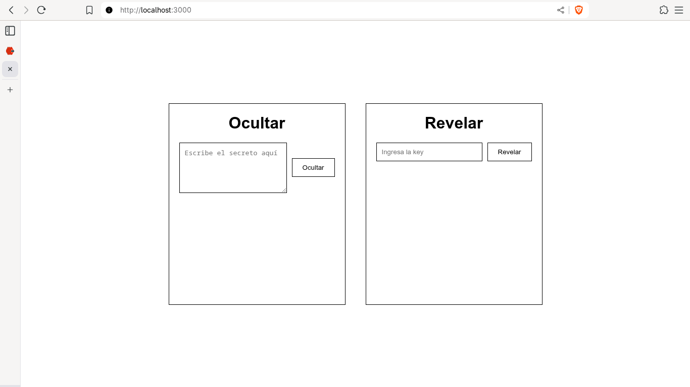
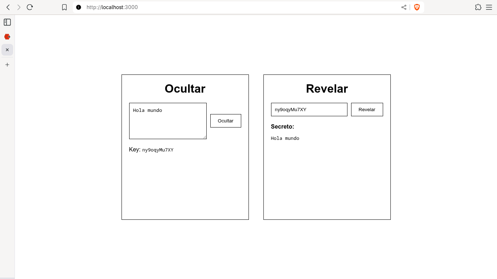

# Proyecto: Enlaces Seguros

Este proyecto tiene como objetivo desarrollar una aplicación web similar a **[scrt.link](https://scrt.link/)**, que permite generar enlaces seguros que pueden visualizarse **una única vez** antes de ser destruidos automáticamente.

## Instrucciones de Ejecución

1. **Clonar el repositorio**

   ```bash
   git clone https://github.com/Pun-Yei/ProgramacionWeb.git
   cd ProgramacionWeb
   ```

2. **Cambiar a la rama de entrega**

   ```bash
   git checkout assessment-3
   ```

3. **Levantar los contenedores con Docker Compose**

   ```bash
   docker compose up --build
   ```

4. **Esperar a que se inicien los servicios**:

   * **Redis** se iniciará en el puerto `6379`.
   * **Backend (Redis UI)** estará en `http://localhost:8081/`
   * **Backend (django)** estará en `http://localhost:8000/`
   * **Frontend (React)** estará en `http://localhost:3000/`


## Funcionamiento General

### Ocultar un secreto

1. En la pestaña **"Ocultar"**, el usuario ingresa un texto en la caja de texto.
2. El frontend envía este texto a la API (`/api/hide/`).
3. La API genera una **key única** y la guarda junto con el mensaje en Redis.
4. La interfaz muestra la **key generada** al usuario.



### Revelar un secreto

1. En la pestaña **"Revelar"**, el usuario ingresa la key recibida.
2. El frontend consulta la API (`/api/reveal/<key>/`).
3. Si la key existe, el mensaje se muestra y la **key se elimina inmediatamente**.
4. Si el usuario intenta volver a acceder con la misma key, se mostrará un **mensaje de error** indicando que ya no existe.



## Tecnologías Utilizadas

| Componente        | Tecnología                     | Descripción                                             |
| ----------------- | ------------------------------ | ------------------------------------------------------- |
| **Frontend**      | React + Vite                   | Interfaz de usuario moderna y reactiva                  |
| **Backend**       | Django + Django REST Framework | API REST para ocultar y revelar secretos                |
| **Base de Datos** | Redis                          | Almacenamiento temporal de los secretos                 |
| **Contenedores**  | Docker & Docker Compose        | Orquestación y despliegue de todos los servicios        |
| **Redis UI**      | RedisInsight / Redis Commander | Herramienta visual para comprobar los datos almacenados |


## Consideraciones Técnicas

* No se pueden generar dos keys iguales.
* Los mensajes solo pueden visualizarse **una vez**.
* El proyecto **no requiere configuraciones adicionales** fuera del `docker compose up`.
* Todos los servicios se levantan automáticamente en sus respectivos puertos.
* La base de datos Redis se limpia al reiniciar los contenedores (datos volátiles).


## Endpoints Principales (Backend Django)

| Método | Endpoint             | Descripción                                  |
| ------ | -------------------- | -------------------------------------------- |
| `POST` | `/api/hide/`         | Guarda un texto secreto y retorna la key     |
| `GET`  | `/api/reveal/<key>/` | Muestra el texto si existe y destruye la key |


## Desarrollado por:

**Sebastian Siquina**
Estudiante de Ingeniería en Informática y Sistemas