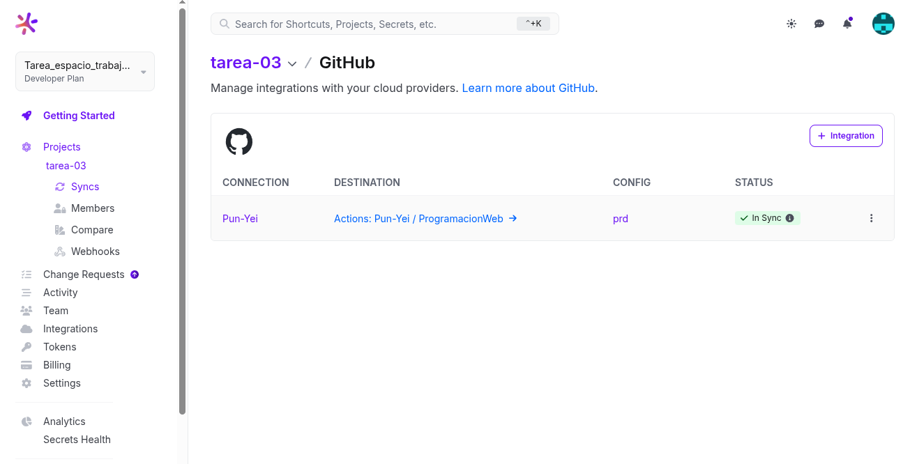
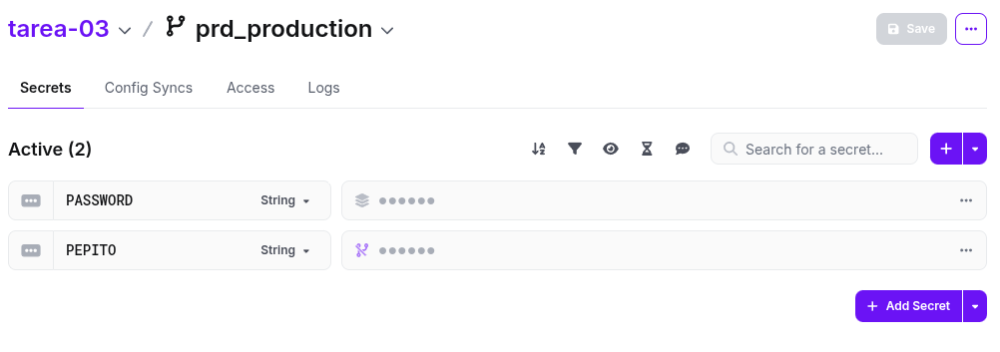
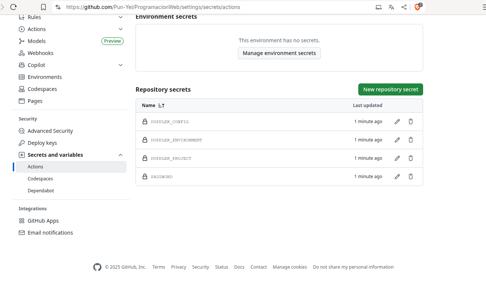

# Documentación de Integración Doppler y Despliegue CDN

## Integración Doppler con GitHub

### 1. Captura de pantalla de la pestaña **Config Syncs** en Doppler

A continuación se muestra la integración activa de Doppler con el repositorio GitHub:

---

### 2. Captura de pantalla de las variables en Doppler

En esta imagen se visualizan las variables configuradas en Doppler (los valores están ocultos para seguridad):

---

### 3. Captura de pantalla de los secretos en GitHub

A continuación se muestra la configuración de los secretos en GitHub Actions, donde están almacenadas las credenciales para el despliegue:

---

### 4. URL pública del CDN CloudFront

El contenido desplegado está disponible en la siguiente URL pública de CloudFront:

[https://d3n4hvu9jdx53.cloudfront.net](https://d3n4hvu9jdx53.cloudfront.net/index.html)
