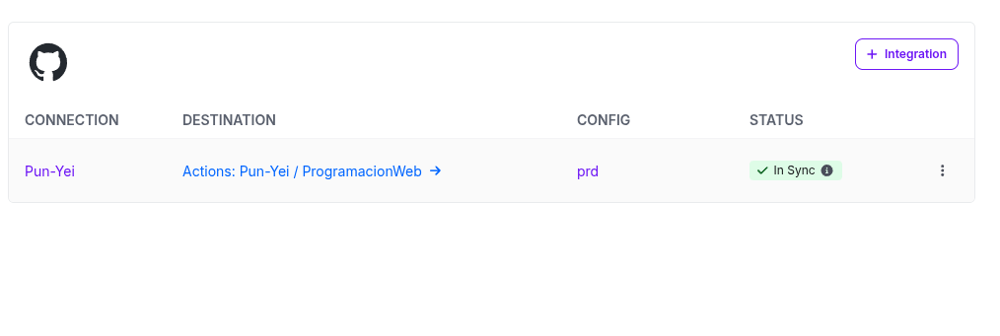
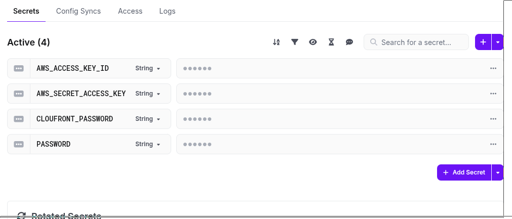
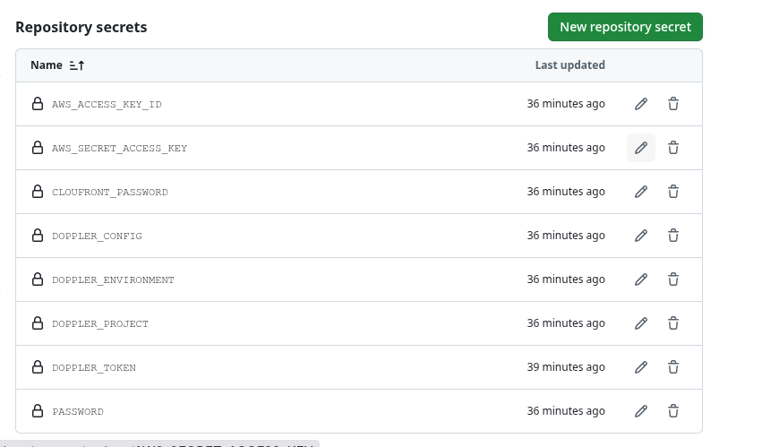
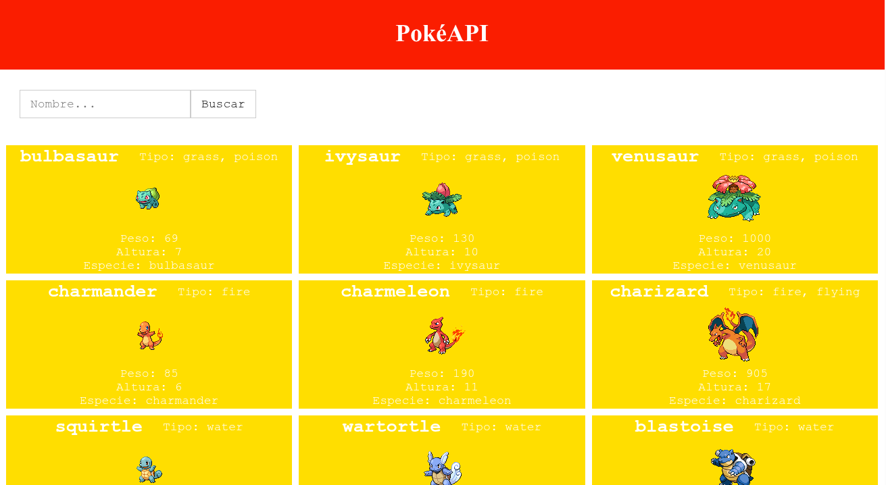

# Pokémon Gallery Web App - Assessment 1

Aplicación web que muestra tarjetas de Pokémon obtenidas dinámicamente desde la [PokeAPI](https://pokeapi.co/). La aplicación es accesible públicamente mediante un CDN en AWS.

## Funcionalidades

- Consumo de la PokeAPI para mostrar Pokémon con:
  - Nombre
  - Imagen oficial
  - Característica adicional (tipo, peso, altura, habilidades, etc.)
- Proyecto configurado con **Vite**, build en `dist/`.
- Despliegue mediante pipeline de GitHub:
  1. Build con Vite
  2. Upload a AWS S3
  3. Invalidate en CloudFront

## Integración de secretos

- Credenciales almacenadas en **Doppler** y conectadas con GitHub.

## Capturas de la entrega

### 1. Config Syncs Doppler

### 2. Variables de Doppler

### 3. Secretos en GitHub

### 4. Aplicación mostrando tarjetas de Pokémon

## URL pública

[Acceder a la aplicación](https://d59womjx74fk6.cloudfront.net/index.html)
